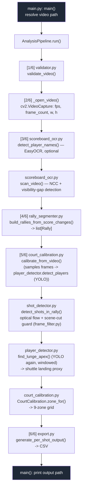

# Architecture

This document traces what actually executes when you run this project's analysis
pipeline, as opposed to what the scaffolding (`src/api/`, `src/models/`, `src/services/`,
`README.md`'s FastAPI description) suggests is there. Those folders are an
unimplemented, stubbed-out future web service (every route handler in `src/api/*.py`
is `async def ... : pass`) and are **not** part of the execution path described below.

The real entry point is [src/main.py](src/main.py), wired up in
[pyproject.toml:23](pyproject.toml#L23) as the `analyze` console script
(`analyze = "src.main:main"`). You can also run it directly:

```bash
python -m src.main <path-to-video.mp4>
# or, with no argument, it picks the first .mp4 in input/
```

## 1. Step-by-step execution flow

All steps run synchronously, in this order, for a single video, on the CPU/GPU
available to OpenCV/PyTorch — there is no async work, no queue, no server.

1. **[main.py](src/main.py) `main()`** — resolves which video file to process
   (CLI arg, or first `*.mp4` in `input/`), ensures `output/` exists, constructs
   `AnalysisPipeline(video_path)`, calls `.run()`.

2. **`AnalysisPipeline.run()`** ([main.py:55](src/main.py#L55)) — the orchestrator.
   It runs six numbered stages and prints `[n/6] ...` progress as it goes:

   - **`[1/6]` Validate** → [validator.py](src/pipeline/validator.py) `validate_video()`
     checks the file exists, is `.mp4`, is under the size limit, and (by opening it
     with `cv2.VideoCapture`) under the duration limit. Raises `ValidationError`
     on failure, which `main()` catches and reports cleanly.

   - **`[2/6]` Open video** → `_open_video()` opens a `cv2.VideoCapture` and reads
     `fps`, total `frame_count`, `frame_width`, `frame_height`. These four numbers
     are threaded through almost every later stage.

   - **`[3/6]` Scan scoreboard** → `_scan_scoreboard()` builds a
     [ScoreboardOCR](src/pipeline/scoreboard_ocr.py) and:
     - *Pass 1 — player names*: samples the first ~5 seconds, and if EasyOCR is
       installed, tries to read the two player-name labels off the broadcast
       overlay (`detect_player_names`). Falls back to generic `"Player 1"` /
       `"Player 2"` if OCR isn't available or doesn't find anything — by design,
       never a name borrowed from a previous run.
     - *Pass 2 — score changes*: `scan_video()` walks the **entire** video at a
       fixed sample interval (default 1s) and detects rally boundaries with two
       pixel-level signals, no digit-reading OCR involved: (a) normalized
       cross-correlation (NCC) between consecutive score-digit crops — a drop
       means a digit changed; (b) the scoreboard overlay disappearing for ≥2s
       (broadcast replay/cutaway), which also marks a boundary.

   - **`[4/6]` Build rallies** → [rally_segmenter.py](src/pipeline/rally_segmenter.py)
     `RallySegmenter.build_rallies_from_score_changes()` turns the list of score-change
     timestamps into `Rally` objects: each one is `(start_frame, end_frame, winner)`,
     where a rally's end is the next score change and its winner is whichever
     player's digit changed.

   - **`[5/6]` Detect shots** → `_detect_shots(rallies)`, the largest stage:
     1. [court_calibration.py](src/pipeline/court_calibration.py) `calibrate_from_video()`
        samples frames *inside* the rally windows (never the in-between footage,
        which would pollute it with replays/crowd shots) and runs YOLO player
        detection (`player_detector.detect_players`) on each. It takes the 5th/95th
        percentile of the two players' foot positions to derive a per-video
        `CourtCalibration`: play-area bounding box, the net's y-coordinate, and
        each player's "home"/ready-stance position.
     2. A [ShotDetector](src/pipeline/shot_detector.py) is built from that calibration.
        For each rally, `detect_shots_in_rally()` runs **dense optical flow**
        (`cv2.calcOpticalFlowFarneback`) frame-to-frame inside the calibrated
        court crop, tracking the dominant vertical motion direction (shuttle going
        up vs. down). A **scene-cut guard** ([frame_filter.py](src/pipeline/frame_filter.py)
        `detect_scene_change`) discards any frame pair that spans a camera cut, so
        a replay transition can't be misread as a shot. Each time the smoothed
        motion direction reverses past an adaptive, per-rally threshold, that frame
        is recorded as a shot boundary. Shots are then alternately assigned to
        `receive_by` 1/2 (badminton volleys alternate by construction).
     3. For each detected shot, `estimate_shuttle_position_apex()` calls
        `player_detector.find_lunge_apex()`, which re-runs YOLO over a small window
        of frames around the shot and picks the frame where the receiving player
        is *furthest from their home position* — that's used as a proxy for where
        the shuttle landed. That pixel position is then mapped to one of the 9
        court zones via `CourtCalibration.zone_for()`.

   - **`[6/6]` Generate output** → `_build_shot_output()` applies the "last shot
     in the rally" rule (did the receiver of the final shot win or lose the
     point → was the shuttle in or out) and
     [export.py](src/pipeline/export.py) `generate_per_shot_output()` writes one
     row per shot to a CSV in `output/`, via `pandas.DataFrame.to_csv`.

3. Back in `main()`: prints the output path and exits. Any unhandled exception
   is re-raised after a message (so a stack trace still surfaces) and exits
   non-zero.

### Code that exists but is *not* on this path

- `src/pipeline/player_tracker.py`, `shuttle_tracker.py`, `score_tracker.py`,
  `zone_mapper.py` — earlier, superseded implementations (fixed-ratio /
  color-heuristic court detection). Nothing in `src/` imports them anymore;
  `player_detector.py` + `court_calibration.py` replaced the first two,
  `CourtCalibration.zone_for()` replaced the third.
- `src/pipeline/court_detector.py` — a real court-line/homography detector.
  It's correctly implemented and wired into `CourtCalibration.zone_for()`, but
  disabled by default (`use_homography=False`) because it measured *worse* than
  the simpler percentile-grid approach for this specific proxy use case (see
  `docs/RESULTS.md`, "Phase C.1").
- `src/api/`, `src/models/`, `src/schemas/`, `src/services/` — stubbed FastAPI
  routes for a not-yet-built web service layer around this pipeline.
- `TrackNetV3_src/` and `data/models/tracknet/*.pt` — vendored, not yet
  integrated. See section 3 below.

## 2. Pipeline diagram



## 3. What YOLO and TrackNet are each doing here

Both are pretrained neural networks used as black-box detectors — neither is
trained or fine-tuned in this codebase. The project just loads published
weights and calls them on frames.

### YOLO — actually used, for player detection

YOLO ("You Only Look Once") is an object detector: given one image, it returns
a list of bounding boxes, each with a class label and a confidence score. This
project uses `ultralytics`' pretrained **YOLOv8n** (`data/models/yolov8n.pt`),
asking it only for class `0` ("person") — see
[player_detector.py:19-31](src/pipeline/player_detector.py#L19-L31).

Concretely, `detect_players(frame)` runs YOLO on a frame, keeps boxes above a
confidence threshold, takes the top-2 by confidence (the two players are the
largest/most-confident "person" detections at broadcast camera distance — ball
boys, line judges, and crowd score lower), and sorts them top-to-bottom (far
court vs. near court).

YOLO gets called in two different places for two different purposes:

1. **Court calibration** ([court_calibration.py](src/pipeline/court_calibration.py)) —
   sampled once per ~1s across each rally to learn where the court actually is
   in this specific video (bounding box, net line, each player's "home"
   position), instead of hardcoding pixel ratios that only worked for one
   camera framing.
2. **Lunge-apex shot landing** ([player_detector.py:90-150](src/pipeline/player_detector.py#L90-L150)) —
   re-run on a small window of frames around each detected shot, to find the
   instant the receiving player is furthest from their home position. That
   player's foot position at that instant stands in for "where the shuttle
   landed," because the actual shuttle is too small/fast to track reliably at
   broadcast resolution — see TrackNet below for the fix planned for that gap.

YOLO never sees or knows about the shuttlecock in this project; it is purely a
person detector being repurposed as a court-position and contact-point signal.

### TrackNet — vendored, not yet wired into the pipeline

`TrackNetV3_src/` is a full standalone implementation of **TrackNetV3**, a
model purpose-built to track a badminton shuttlecock frame-by-frame: it takes
a short sequence of frames and outputs a heatmap predicting the shuttle's
(x, y) pixel position in each one, plus a second "inpainting" network
(`InpaintNet_best.pt`) that fills in plausible positions for frames where the
shuttle is occluded or motion-blurred enough that the main network can't see
it directly.

Checkpoint weights are already present (`data/models/tracknet/TrackNet_best.pt`,
`InpaintNet_best.pt`), and there's a working `predict.py` CLI in
`TrackNetV3_src/` — but **nothing in `src/` imports or calls into
`TrackNetV3_src/`**. The two live side-by-side in the repo, not connected.

Per `docs/PRD_v2.3.md`, this is intentional and sequenced: shuttle tracking
("Phase D") was deliberately deferred in favor of player tracking ("Phase C",
the YOLO work above), because a player is large and high-contrast while the
shuttle is a handful of pixels that's frequently invisible at broadcast
resolution — exactly the harder problem TrackNet exists to solve. The
lunge-apex/foot-position proxy described above is the interim stand-in for
"where did the shuttle land" until TrackNet is actually integrated.

## 4. Glossary

Terms as used specifically in this codebase, for a reader new to ML/CV but
comfortable with code:

- **YOLO ("You Only Look Once")** — a pretrained object-detection model.
  Input: one image. Output: a list of `(box, class, confidence)`. Here, only
  the `"person"` class is used. See `ultralytics.YOLO` in
  [player_detector.py:28](src/pipeline/player_detector.py#L28).
- **Bounding box** — the `(x1, y1, x2, y2)` rectangle YOLO draws around a
  detected object. `PlayerBox` in this codebase wraps one, plus helpers like
  `foot_point` (bottom-center — a proxy for where someone is standing).
- **Confidence / `conf_threshold`** — a 0–1 score the model attaches to each
  detection; boxes below `conf_threshold` (0.35 here) are discarded as
  probably-not-real detections.
- **Checkpoint (`.pt` file)** — a file of trained model weights (PyTorch's
  serialization format). "Loading a model" here just means reading one of
  these files into a network architecture defined in code (`model.py` for
  TrackNet; YOLOv8's architecture ships inside `ultralytics`).
- **Heatmap (TrackNet)** — instead of directly outputting a single (x, y),
  TrackNet predicts a 2D grid of "how likely is the shuttle at this pixel,"
  and the actual coordinate is extracted afterward as the grid's peak. More
  robust to a tiny, fast-moving, sometimes-blurred object than predicting a
  raw coordinate.
- **Inpainting (TrackNet)** — filling in a gap in a sequence (here: frames
  where the shuttle wasn't detected) using the surrounding context, the same
  idea as photo inpainting but applied to a trajectory instead of pixels.
- **Optical flow** — a per-pixel estimate of motion between two consecutive
  frames (`cv2.calcOpticalFlowFarneback`). Output is a vector field: for every
  pixel, how far and in what direction it appears to have moved. This project
  only looks at the vertical component (`vy`) to detect "motion reversed
  direction = a shot probably just happened."
- **NCC (normalized cross-correlation)** — a similarity score between two
  image patches, 1.0 = identical, lower = more different, robust to overall
  brightness shifts. Used to detect when a scoreboard digit changed without
  doing OCR (digit recognition) — a changed digit just correlates worse with
  the previous frame's digit crop.
- **Homography** — a matrix that maps points from one flat plane's
  perspective view (the camera's image of the court) onto a top-down,
  real-world coordinate system. Lets you convert "this pixel" into "this many
  cm from the court's corner," correcting for camera angle/perspective.
  Implemented in `court_detector.py` but disabled by default for this
  project's use case (see section 1).
- **Calibration (`CourtCalibration`)** — this project's own per-video derived
  geometry (play-area bounding box, net y-coordinate, each player's "home"
  position), computed at runtime from observed player positions rather than
  hardcoded for one video's camera framing.
- **Rally vs. shot** — a *rally* is one continuous point of play, from serve
  to the point being won (boundaries detected via scoreboard changes). A
  *shot* is one single shuttle exchange/hit within a rally (boundaries
  detected via optical-flow direction reversals). One rally contains many
  shots.
- **Zone** — the court is divided into a 3×3 grid (9 zones) per player's half;
  every shot's landing position is reduced to "which of these 9 cells."
- **Lunge apex** — the frame, within a small window around a detected shot,
  where the receiving player is furthest from their resting "home" position —
  used as the best available proxy for "where they made contact with the
  shuttle," since the shuttle itself isn't being tracked yet.
- **Scene-cut / scene-change guard** — a check (histogram comparison between
  frames) that detects camera cuts (e.g. a broadcast replay insert) so that
  the optical-flow/motion code doesn't misinterpret the meaningless jump
  between two unrelated shots as in-play shuttle motion.
- **`cv2.VideoCapture`** — OpenCV's handle to a video file; supports seeking
  to an arbitrary frame (`cap.set(cv2.CAP_PROP_POS_FRAMES, n)`) and reading
  frames sequentially (`cap.read()`).
